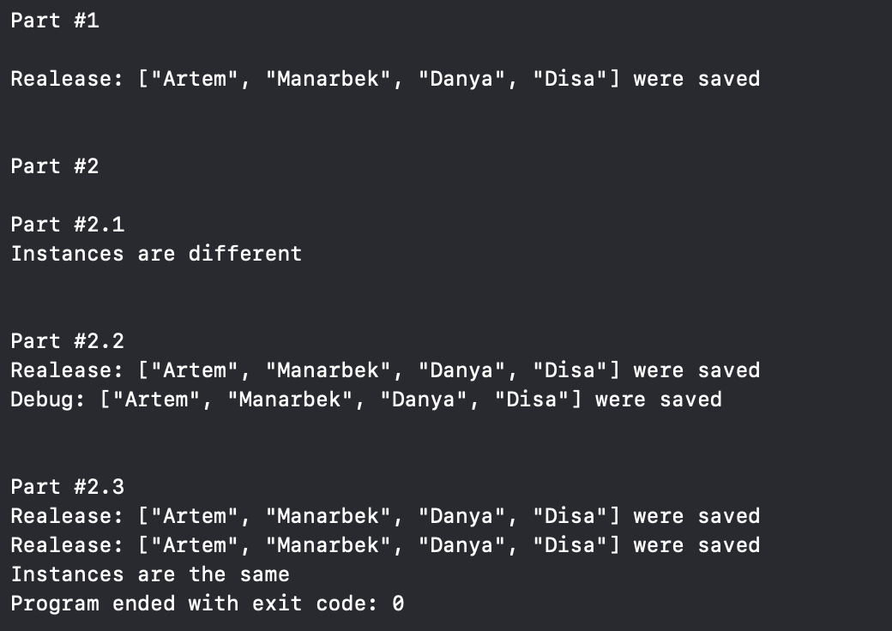

# Get Started with Swinject

## Itroduction

В данном проекте происходит знакомсто с патерном *DI* и изучаются основы работы с модулем **Swinject**.

Проект разбит на три части: [получение объекта с использованием фабричного метода](#получение-объекта-с-использованием-фабричного-метода), [получение объекта с использованием именнованных зависимостей](#получение-объекта-с-использованием-именнованных-зависимостей) и [получение единственного экземпляра](#получение-единственного-экземпляра). 

## Получение объекта с использованием фабричного метода

  1. Создать объект `container` и зарегистрировать в нем `NetworkService` с реализацией `NetworkServiceImpl`, `DatabaseService` с реализацией `ReleaseDatabaseServiceImpl`
  2. Зарегистрировать в `container` `UserRepository` с использованием `DatabaseService` и `NetworkService` из п.1
  3. Получить объект `UserRepository` из `Container` и вызвать метод `Update`.  Получить еще один объект `UserRepository` из `Container` и сравнить полученные объекты.

## Получение объекта с использованием именнованных зависимостей

  1. Создать объект `container` и зарегистрировать в нем `NetworkService` с реализацией `NetworkServiceImpl`, `DatabaseService` с реализацией `ReleaseDatabaseServiceImpl` и именем **release**, DatabaseService` с реализацией `DebugDatabaseServiceImpl` и именем **debug**
  2. Зарегистрировать в `container` объекты `UserRepository` с использованием `DatabaseService`, `NetworkService` с именами **release** и **debug**
  3. Получить объекты `UserRepository` из `Container` с именами **release** и **debug** и вызвать метод `Update` у каждого. 

## Получение единственного экземпляра

  1. Создать объект `container` и зарегистрировать в нем `NetworkService` с реализацией `NetworkServiceImpl`, `DatabaseService` с реализацией `ReleaseDatabaseServiceImpl`
  2. Зарегистрировать в `container` объект `UserRepository` с использованием `DatabaseService`, `NetworkService`. При создании указать паттерн **singletone**.
  3. Получить объект `UserRepository` из `Container` и вызвать метод `Update`.  Получить еще один объект `UserRepository` из `Container` и сравнить полученные объекты.

