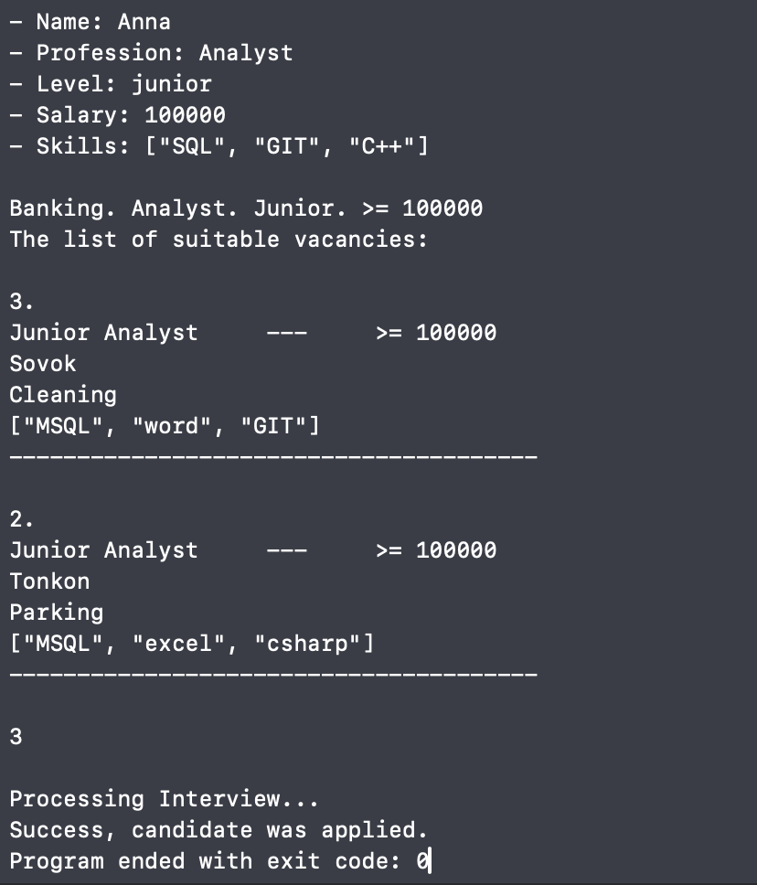

# HR Service Tool

## Introduction

В данном проекте реализованы консольные приложения для подбора и анализа резюме. [Work Searcher](#candidate-searcher) собирает информацию о кандидате и на основе его навыков и запросов предлагает список потенциальных компаний-работодателей. Из списка выбирается одна из компаний и проводится интервью, результат которого выводится в консоль. [Resume Analyzer](#resume-analyzer) считывает с файла **resume.txt** информацию о кандидате и проводит анализ резюме. Ананлиз проводится в том числе по тегам, представленным в **tags.txt**. Результатом выполнения являются два файла **export.txt** и **analysis.txt**.

## Work Searcher



## Resume Analyzer

В результате работы программы получили файлы **export.txt** и **analysis.txt**. Содержание **analysis.txt** представлено ниже

```text
# Words
QA - 2
Worked - 2
as - 2
a - 1
specialist - 1
from - 1
head - 1
heels. - 1
Analyst - 1
to - 1
I'm - 1

Matched tags
QA

```
