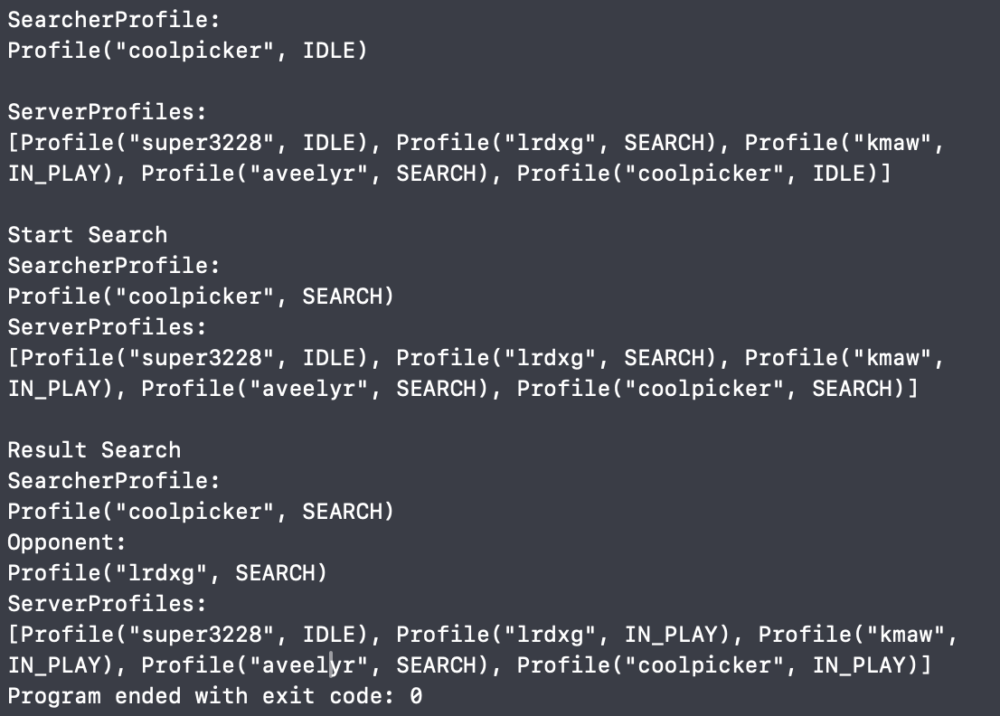

## Iteractive Fiction

# Introduction 

В данном проекте будет рассмотрена реализация дженериков. Для этого буде разработано консольное приложение, имитирующее игровой сервер. Персонажи игроков будут иметь оружие, в данной реализации это будут револьверы.

## Overview

На первом этапе предстоит реализация классса, моделирующего револьвер. Данный класс будет типизированным.

```swift
class RevolverMoonClip {
    var clip: [Patron?] = []
    var caliber: Int?
    static var usedPatrons = Set<UUID>()

    init(_ arr: [Patron?] = [Patron?](repeating: nil, count: 6)) throws
    init()

    var pointer: Patron? {
        get {
            clip[0]
        }
    }

    func add(_ item: Patron) -> Bool
    func unload(index: Int) throws -> Patron? 
    func unloadAll() -> [Patron?] 
    func shoot() -> Patron? 
    func scroll()
    func getSize() -> Int 
    func clipToStr() -> String
    
    subscript(index: Int) -> Patron? 
}
```

После этого реализуем класс `Patron` и добавим реализацию в класс `Revolver`.

```swift
class Patron {
    let num = UUID()
    let state: PatronState
    let caliber: Int

    func shoot()
    static func == (lhs: Patron, rhs: Patron) -> Bool 
    
    init(state: PatronState, caliber: Int)
}
```

На следующем эапе реализуем класс `Server` и `Profile`. 

```swift
protocol PlayerAction {
    func findOpponent(_ person: Profile) -> Profile?
}

class Server: PlayerAction {

    let address: String
    var players: [Profile]

    init(url: String, players: [Profile] = [])

    func findOpponent(_ person: Profile) -> Profile?
    func showPlayers() -> String
    func addProfile(_ profile: Profile) -> Bool
}
```

Класс `Profile` должен содержать:

```swift
class Profile {
    let id = UUID()
    let nickname: String
    let age: Int
    let name: String
    var gun: RevolverMoonClip?
    let signUpDate: String
    var status: Status
    lazy var url: String  = {
            "http://gameserver.com/\(id)-\(nickname)"
    }()
    var playerActionDelegate: PlayerAction? = nil

    init(nickname: String, age: Int, name: String, gun: RevolverMoonClip? = nil, date: String, status: Status)

    func findOpponent() -> Profile?
    func toString() -> String
}

enum Status: String, CaseIterable {
    case IN_PLAY = "IN_PLAY"
    case SEARCH = "SEARCH"
    case IDLE = "IDLE"
    case OFFLINE = "OFFLINE"
}
```



