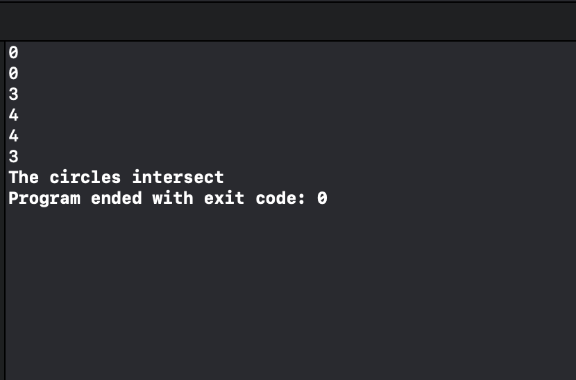
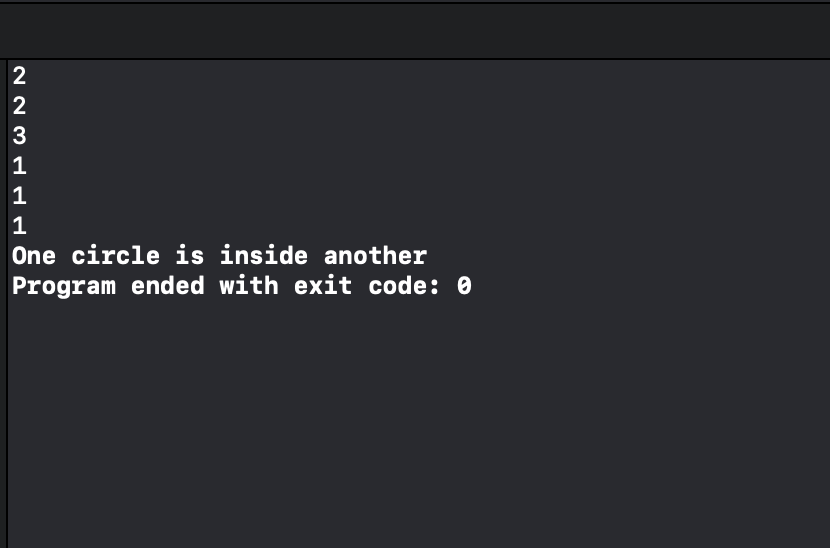
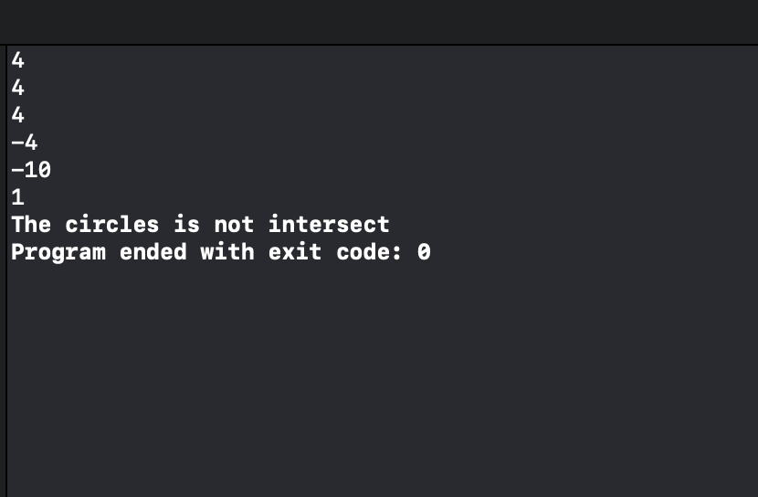
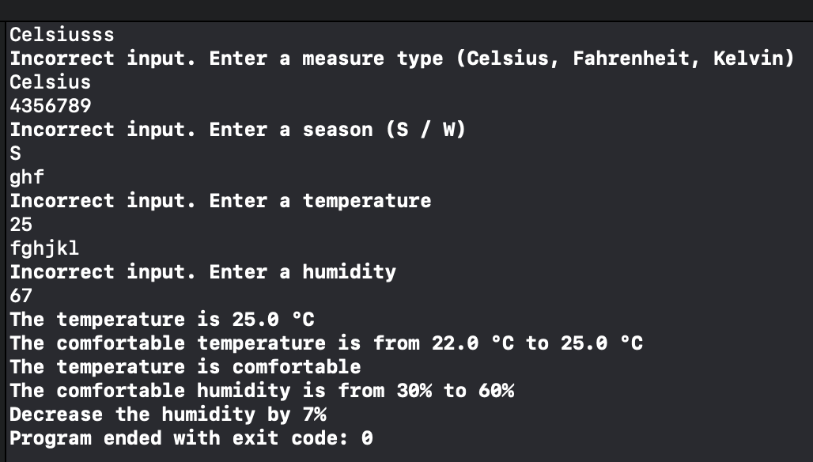

# Program Modules

## Introduction

В данном проекте реализованы 2 программынх модуля: для [анализа окружносей](#анализ-окружностей) и ["умный" термометр](#умный-термометр).

## Анализ окружностей

В данном проекте разработан консольный инструмент, который определяет взаимное положение двух окружностей. Результатом работы является одно из сообщений:

- не пересекаются
- есть пересечение
- одна окружность расположены внутри другой

## "Умный" термометр

Данный модуль в результате своей работы определяет и выводит комфортную для человека температуру и влажность с учетом сезона, а также дает рекомендацию по увеличению/уменьшению влажности на минимальный необхоимый процент.

