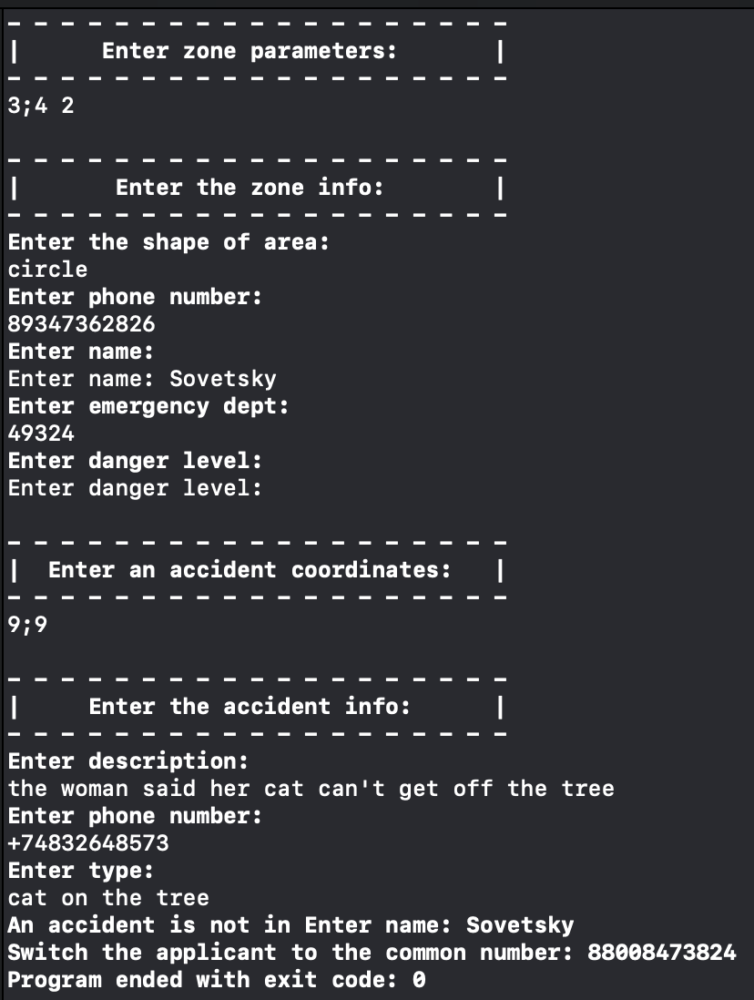
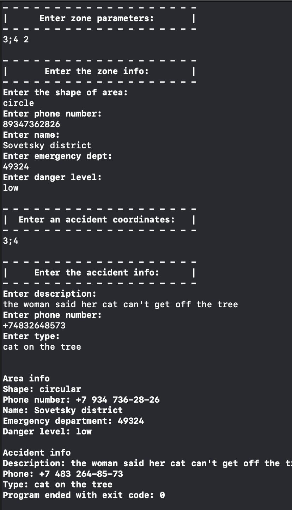

# Rescue Service

# Introduction

В данном проекте реализовано консольное приложение, которое анализирует информацию об отслеживаемой территории. На вход приложения подаются параметры зоны и параметры проишествия. Результатом работы является анализ формы зоны и ответ, произошло проишествие внутри зоны или нет.

Дополнительно реализовано расширение для **String**, которое форматирует номер телефона.

